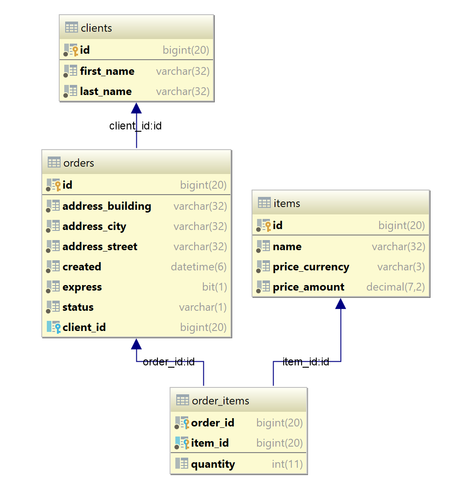

# How to Use Hibernate: Main Problems and Their Solutions
My name is Andriy Slobodyanyk, I have been working in Java enterprise projects for more than 10 years.
Each of them has data in the database, and access to them is provided by JPA / Hibernate.
At the same time, the framework is used, it seems to me, not quite correctly: the code could be more compact and the performance could be higher.

This article is about troubles: the main problems, how to fix them, and, most importantly, the approach where Hibernate is appropriate.

*Words “JPA” as a standard and “Hibernate” as an implementation are used synonymously.*

## Verification Questions
```java
@Column (name = "first_name", nullable = false, length = 32)
private String firstName;
```
* What is the `nullable` attribute for?
* Is it possible to create and save an entity if the `firstName` field is null?
* Is field length checked?
* What is the difference between these `@Column` attributes and `@javax.validation.constraints.NotNull` and `@Size` annotations?

If you are not sure about the answers, welcome to the article.

## Approach
Hibernate is not needed automatically wherever there is a database.
You shouldn't start with it.
JPA by its very definition applies when it turns out that Java objects need to be stored somewhere between application shutdowns.
One of the possible options is a relational database.

So create **convenient** classes that describe your domain model as if you don't have JPA.
Use the whole expressiveness of Java: different types, composition, inheritance, collections, Maps, Enums.
Only then translate it to JPA: add ID, relationships and cascades.
Check the tables created by Hibernate, correct them if necessary.

This sounds too broad and abstract, so let's take a case study.

## Problem Statement

Let's say we develop a shop with orders.

An order has:
* creation date
* status that is new, in processing, etc.
* might be express
* delivery address (each time different, so there's no sense in normalization yet)
* includes various items in some quantity
* the item has a fixed price with currency
* belongs to a specific client

## Typical Approach
The next thing happens for some reason.
First, tables are created, something like that:



...and then corresponding tables for them.
Depending on the developers' experience, the hardest case is this.

```java
@Entity
@Table(name = "orders")
public class OrderEntity { 
    @Id
    private Long id;

    private LocalDateTime created;
    private String status; // see StatusConstants for available values
    private Integer express;

    private String addressCity;
    private String addressStreet;
    private String addressBuilding;

    private Long clientId;

    public static class StatusConstants {

        public static final String NEW = "N";
        public static final String PROCESSING = "P";
        public static final String COMPLETED = "C";
        public static final String DEFERRED = "D";

        public static final List<String> ALL = Arrays.asList(NEW, PROCESSING, COMPLETED);
        // oops, forgot to add "deferred" to the list
    }
}

@Entity
@Table(name = "items")
public class Item { 
    @Id
    private Long id;

    private String name;
    private BigDecimal priceAmount;
    private String priceCurrency;
}
```

These are quite working entities made on the principle of "the field in the database - the same field in the class", but not the best.
Of all Hibernate features, we use only one - mapping between tables and classes.
In fact, this is work in JDBC mode.

Problems:

* address and price are "smeared" into several fields
* integrity and operations with the client field are done manually
* it's easy to err on the status field values
* you should keep in mind that the express flag is represented by the number: 1 - true, 0 - false

With some experience it's possible to create more convenient mapping, but the very idea - to fit entities under tables - in the case of JPA is not true.

By the way, the approach to build an application from a database also takes place, but the tools for it are different, for example:
* database
* complex queries written manually with all possible optimizations
* mapper in Java classes like [MyBatis](http://www.mybatis.org/mybatis-3/)

**JPA offers another principle: first Java classes, then save them in the database.**

So let's put Hibernate aside and create an object model for the initial task.

Obviously, that:
* it's convenient to use Enum for the order status
* the "express" flag is boolean by its very nature
* there will be a separate class for the address
* for the price - too, and there is already a ready - Money from [JavaMoney](https://javamoney.github.io/)
* for items and their quantity, Map will do
* the order client is a field of the Client type, not a numeric pointer to it

The result is following:

```java
public class Order { 
    private LocalDateTime created;
    private Status status;
    private boolean express;
    private Address address;
    private Map<Item, Integer> items;
    private Client client;
}

public class Address {
    private String city;
    private String street;
    private String building;
}

public class Item {
    private String name;
    private Money price;
}

public class Client {
    private String firstName;
    private String lastName;
}
```

## Collections
Since JPA knows how to initialize collections itself, developers often limit themselves to declaring them, as in the example above, and further modifications are made through the getter or, even worse, through setter.

Given the basic principle of "The class must be able to work without JPA" is better:

* initialize the collection immediately: at the place of the declaration or in the constructor
* remove the setter
* in the getter, return an unmodifiable copy
* add modifying methods

For our example, it may be so:

```java
public class Order {
    private final Map<Item, Integer> items = new HashMap<>();

    public Map<Item, Integer> getItems() {
        return Collections.unmodifiableMap(items);
    }

    public void addItem(Item item) {
        items.merge(item, 1, (v1, v2) -> v1 + v2);
    }

    public void removeItem(Item item) {
        items.computeIfPresent(item, (k, v) -> v > 1 ? v - 1 : null);
    }
}
```

Also, it is pertinent to remind that though Hibernate demands for the work the empty constructor, for initialisation of objects it is possible and it is necessary to use constructors with parameters.

## Using JPA
That's what it takes:

* If you want the class to be stored in a separate table - put annotations `@Entity` and `@Id`, if in the table of another class - `@Embeddable`
* Primitives, numbers, strings and dates (including Java8 ones) can be stored by Hibernate itself
* For Enum, we specify `@Enumerated` and the type: to store either its ordinal number - `EnumType.ORDINAL`, or a string representation - `EnumType.STRING`
* Also, for Enum and other objects that need only one field in the database, it is convenient to use `AttributeConverter`
* Classes consisting of several fields and not corresponding to the conventions of Java Bean - Money in our case - require `@Type` with the description of the conversion similar to AttributeConverter
 For Money, the required class is [already written](http://jadira.sourceforge.net/)
* For classes and collections, the appropriate relations are specified (ManyToOne, OneToMany, ElementCollection, etc.)

After that Hibernate can easily create the necessary tables.

This information may be new for someone, but `@Table` and various `@Column`:

* are optional and contain only DDL attributes
* are not validations

The answer to the introductory question:

```java
@Column(name = "first_name", nullable = false, length = 32)
private String firstName;
```
... is converted into a part of the "create table" statement.

```sql
first_name varchar(32) not null;
```
There are no null and field length checks in Java runtime.

Since the class structure changes during application development, the created JPA scheme is rather a draft for flyway/liquibase and/or in-memory database.

## Null
Null in both Java and the database should only be used when we really need the value "undefined".
In many cases this is not necessary.
If we are too lazy to initialize the fields, we either put a rake in the form of NPE or sprinkle the code with unnecessary null checks.

At first glance, the order express field has three states - "yes", "no", "not specified".
In practice, we will most likely need two - express and regular orders.
So use primitives (boolean) instead of classes (Boolean) where possible.

It is important to remember that primitives cannot be used for the id field, because it is not defined for new (transient) entities.
And, unfortunately, for technical reasons (so that Hibernate can create a proxy) it is not possible to specify a **final** modifier.

## Field Naming
By default, JPA uses this naming convention for fields and classes `fieldName` (in java) -> `field_name` (in database).

Therefore, it makes sense to specify in `@Column(name = "another_name")` if it is not.
In our example, "order" is a keyword in SQL, so I named the table "order**s**", and the rest in the plural for uniformity.

## Primary Keys
They are natural and surrogates.
Surrogate keys have tangible advantages - convenience and performance, so we will use them.

For all (except Address) we add:

```java
@Id
private Long id;
```

## (Non-)Usage of Id
When writing business logic, objects are compared with each other.
Some people write like this:

```java
boolean equals = order.getId().equals(anotherOrder.getId());
```
... and object belonging to the collection is checked with the help of the stream

```java
boolean contains = orders.stream().anyMatch(o -> o.getId().equals(someOrder.getId());
```
This is not compact and not quite right. It is better:

```java
boolean equals = order.equals(anotherOrder);

boolean contains = orders.contains(someOrder);
```

Surrogate keys - IDs - should not appear in business logic or in queries.
Always work with objects.
Instead of the `clientId` parameter

```jpaql
select o from Order o where o.client.id = :clientId
```
... there must be an object

```jpaql
select o from Order o where o.client = :client
```

Let the JPA build the request itself.

If there is no client object in the context, and you don't need it at all, it's enough to use its reference.
That is, instead of
```java
Client client = em.find(Client.class, clientId);
```
use
```java
Client client = em.getReference(Client.class, clientId);
```

## Equivalence (equals/hashCode methods)
To compare objects, as mentioned above,
```java
boolean equals = order.equals(anotherOrder);
```
you need to define the methods of equals and hashCode.
They are often implemented through id:

```java
public class Order {

    @Override
    public boolean equals(Object o) {
       if (this == o) return true;
       if (o == null || getClass() != o.getClass()) return false;
       Order that = (Order) o;
       return Objects.equals(id, that.id);
    }
    
    @Override
    public int hashCode() {
       return Objects.hash(id);
    }
}
```
... but it's not quite right.

It follows from our principle - not to get attached to JPA - that the surrogate id should not appear in equals/hashCode.
It is important to remember that for new (transient) entities the id field is not yet initialized (equals null).
However, the equivalence must work correctly regardless of the state of the entity.

Objects must be compared by their business key, not by their IDs, if possible.

For the Order class, a pair of date-client fields might be used as a business key.

```java
public class Order {

    @Override
    public boolean equals(Object o) {
       if (this == o) return true;
       if (!(o instanceof order)) return false;
       Order order = (Order) o;
       return Objects.equals(created, order.getCreated())
               && Objects.equals(getClient(), order.getClient());
    }
    
    @Override
    public int hashCode() {
       return Objects.hash(created, getClient());
    }
}
```

Note that Hibernate can create proxy objects, and the class should be checked using `instanceOf` rather than `getClass()` method.
Also, we should use `getClient()` to compare a real object not its proxy.
Fortunately, in Lombok takes care of these issues.

Only in exceptional cases, if some class has nothing that can be used as a business key except its id field, `equals()` is checked through identity (==) and id equivalence, and `hashCode()` without fields degenerates into a constant.

```java
public class Foo {
    @Override
    public boolean equals(Object o) {
       if (this == o) return true;
       if (!(o instanceof Foo)) return false;
       Foo that = (Foo) o;
       return id != null && id.equals(that.getId());
    }
    
    @Override
    public int hashCode() {
       return 31;
    }
}
```
Vlad Michalcea reveals the subject in more detail:

* ["The best way to implement equals, hashCode, and toString with JPA and Hibernate"](https://vladmihalcea.com/the-best-way-to-implement-equals-hashcode-and-tostring-with-jpa-and-hibernate/)
* ["How to implement equals and hashCode using the JPA entity identifier (Primary Key)"](https://vladmihalcea.com/how-to-implement-equals-and-hashcode-using-the-jpa-entity-identifier/)
* ["How to implement Equals and HashCode for JPA entities"](https://vladmihalcea.com/hibernate-facts-equals-and-hashcode/)

## Cascades 
JPA is designed to simplify routine operations in every way.
To save and delete complex objects there is no need to "run" through the structure and repeat operations for nested objects, just specify cascades.

In our example, when creating a new order for a new user does not need to save them separately, the cascade will do it.

An obvious nuance: before specifying `CascadeType.ALL`, think about whether you need `CascadeType.REMOVE` included.
Again, for our example - no, when you delete an order, the client is not deleted, so `ALL` does not apply.

## Entity and DTO
If we're developing a Web application, we can't do without passing entities to GUI and back.
The theory teaches us that separate DTO classes should be used for transferring.
Often, in case of simple entities like `Client` and `Address` in our example, the `ClientDto` and `AddressDto` fields will be exactly the same.
The temptation arises not to create separate classes, but to use existing ones.
This is not the right approach.

You might have fields that are only needed for the DTO.
You have to mask them from saving them to the database using `@Transient`.
It might be required to change the field values before sending them to the UI.
To prevent these modifications not being reflected in the database, `entityManager.detach()` calls are started.

Collections by default work in lazy loading mode and go to GUI empty.
Changing the mode to `FetchType.EAGER` creates a serious performance issue.
Collection items will now be loaded in all cases and raise an [N+1 problem](https://stackoverflow.com/questions/97197/what-is-the-n1-selects-problem-in-orm-object-relational-mapping).
Do not do that.
Entity and DTO have different responsibilities.
Validation of user entered data - `@NotNull`, `@Size`, etc checks - should be done by the DTO.

The correct approach is always to create separate DTO classes.
Use [MapStruct](http://mapstruct.org/) or its [analogues](https://www.baeldung.com/java-performance-mapping-frameworks) to shorten the boiler-plate code.

## FetchType.EAGER
Historically, Hibernate has used the default EAGER fetch mode for ManyToOne and OneToOne, and in all other cases - LAZY.
It is recommended to use LAZY in all cases.
It is always possible to specify in the query to make join instead of multiple selects, and to disable EAGER for certain cases - is never possible.

Again, Vlad speaks up - ["EAGER fetching is a code smell when using JPA and Hibernate"](https://vladmihalcea.com/eager-fetching-is-a-code-smell/).

## EntityManager.flush() and clear()
Another alarming marker is the numerous `flush()` and `clear()` calls.
Somehow, instead of entrusting management of the entity framework, developers start to interfere in this process.

Only two exceptional situations come to mind when these methods are needed:

* processing a very large amount of data (reports), to prevent 1st level cache overflow;
* calling business logic from stored procedures during a transaction, in this case `flush()` is needed.

In all other cases these calls are most likely unnecessary and only worse performance.

## Project Lombok
It's a great thing, it reduces the amount of code.
With JPA, however, you have to consider the nuance.
`@Data` by default includes `@EqualAndHashCode` and `@ToString` for all fields, which in turn may generate a cascade of unnecessary field loads ignoring carefully specified FetchType.LAZY, and looped calls for bi-directional relationships.
Therefore, it is recommended not to use `@Data`, but to specify only the required fields in `@EqualsAndHashCode` and `@ToString`.

## Correct Entities
Applying all the above to our classes, we get:

```java
@Getter
@EqualsAndHashCode(of = {"firstName", "lastName"})
@ToString(of = {"firstName", "lastName"})
@NoArgsConstructor(access = AccessLevel.PROTECTED)
@Entity
@Table(name = "clients")
public class Client {
    @Id
    @GeneratedValue(strategy = GenerationType.IDENTITY)
    private Long id;

    @Column(length = 32, nullable = false)
    private String firstName;

    @Column(length = 32, nullable = false)
    private String lastName;

    public Client(String firstName, String lastName) {
        this.firstName = firstName;
        this.lastName = lastName;
    }
}

@Getter
@EqualsAndHashCode(of = "name")
@ToString(of = {"name", "price"})
@NoArgsConstructor(access = AccessLevel.PROTECTED)
@Entity
@Table(name = "items")
public class Item { 
    @Id
    @GeneratedValue(strategy = GenerationType.IDENTITY)
    private Long id;

    @Column(nullable = false, length = 32)
    private String name;

    @Columns(
            columns = {
                    @Column(name = "price_currency", length = 3, nullable = false),
                    @Column(name = "price_amount", precision = 7, scale = 2, nullable = false)
            }
    )
    @Type(type = "org.jadira.usertype.moneyandcurrency.moneta.PersistentMoneyAmountAndCurrency")
    private Money price;

    public Item(String name, Money price) {
        this.name = name;
        this.price = price;
    }
}

@Getter
@EqualsAndHashCode(of = {"city", "street", "building"})
@ToString(of = {"city", "street", "building"})
@NoArgsConstructor(access = AccessLevel.PROTECTED)
@AllArgsConstructor
@Embeddable
public class Address {
    private String city;
    private String street;
    private String building;
}

@AllArgsConstructor
public enum Status {
   NEW("N"),
   PROCESSING("P"),
   COMPLETED("C"),
   DEFERRED("D");

   @Getter
   private final String code;

   public static OrderStatus findBy(String code) {
       return Stream.of(values())
               .filter(v -> v.getCode().equals(code))
               .findFirst()
               .orElseThrow(() -> new IllegalArgumentException("Unknown code " + code));
   }
}

@Converter(autoApply = true)
public class StatusConverter implements AttributeConverter<Status, String> { 
    @Override
    public String convertToDatabaseColumn(Status status) {
        return status.getCode();
    }
   
    @Override
    public Status convertToEntityAttribute(String code) {
        return Status.findBy(code);
    }
}

@Getter
@EqualsAndHashCode(of = {"created", "client"})
@ToString(of = {"created", "address", "express", "status"})
@NoArgsConstructor(access = AccessLevel.PROTECTED)
@Entity
@Table(name = "orders")
public class Order {
    @Id
    @GeneratedValue(strategy = GenerationType.IDENTITY)
    private Long id;

    @Column(nullable = false)
    private final LocalDateTime created = LocalDateTime.now();

    @Embedded
    @AttributeOverride(name = "city", column = @Column(name = "address_city", nullable = false, length = 32))
    @AttributeOverride(name = "street", column = @Column(name = "address_street", nullable = false, length = 32))
    @AttributeOverride(name = "building", column = @Column(name = "address_building", nullable = false, length = 32))
    private Address address;

    @Setter
    private boolean express;

    @Column(length = 1, nullable = false)
    @Setter
    private Status status = Status.NEW;

    @ManyToOne(fetch = FetchType.LAZY, cascade = CascadeType.PERSIST, optional = false)
    private Client client;

    @ElementCollection
    @Column(name = "quantity", nullable = false)
    @MapKeyJoinColumn(name = "item_id")
    private final Map<Item, Integer> items = new HashMap<>();

    public Order(Address address, Client client) {
        this.address = address;
        this.client = client;
    }

    public Map<Item, Integer> getItems() {
        return Collections.unmodifiableMap(items);
    }

    public void addItem(Item item) {
        items.merge(item, 1, (v1, v2) -> v1 + v2);
    }

    public void removeItem(Item item) {
        items.computeIfPresent(item, (k, v) -> v > 1 ? v - 1 : null);
    }
}
```

Numerous `@Table` and `@Column` annotations are used only to generate the exact same scheme as the diagram.
Note: In practice, it is better to use sequence to generate the id.

An attentive reader should notice that using the client field with lazy loading in `Order::equals()` is against the recommendations of the Lombok section.
If business logic allows, it is better to implement equivalence without it.

## Conclusion
The JPA topic is quite extensive and Hibernate unfortunately contains a lot of "gotchas" to cover all the nuances in one article.

Many useful and interesting things are [in Vlad Mikhalchea blog](https://vladmihalcea.com/tutorials/hibernate/).

They are left behind:

* inheritance
* uni- and bi-directional relationships
* strategies for working with collections
* criteriaBuilder
* batching
* QueryDSL
* and many other topics

When meeting them, I would recommend sticking to the basic message that I tried to illustrate in every possible way - **first a fully working object model**, then the questions of how to save it to the database, not vice versa.
